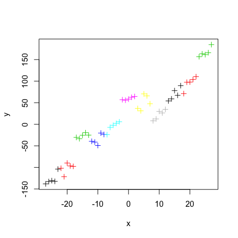
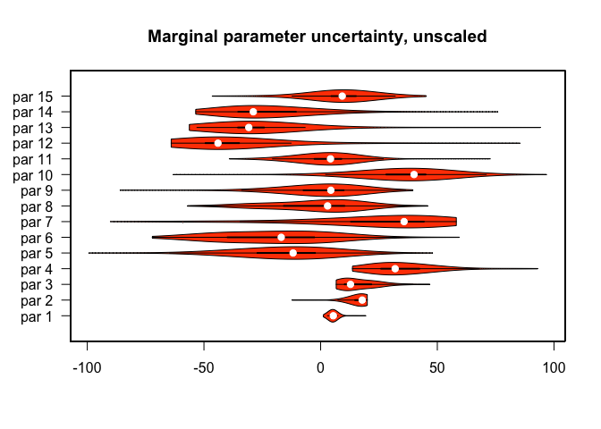
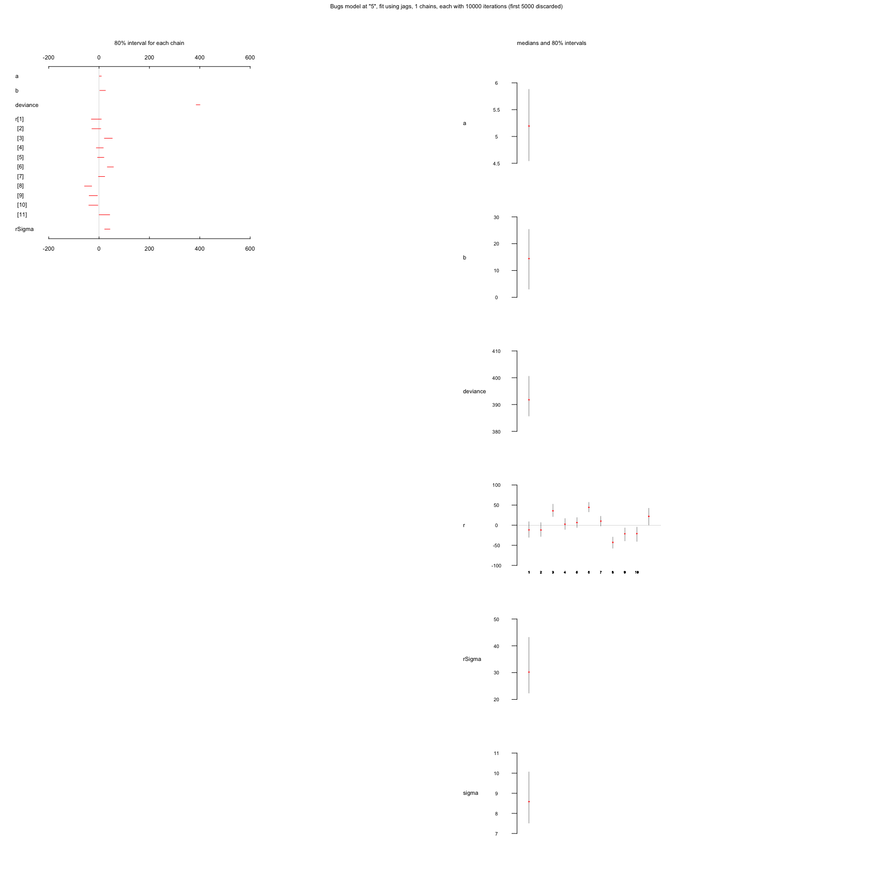
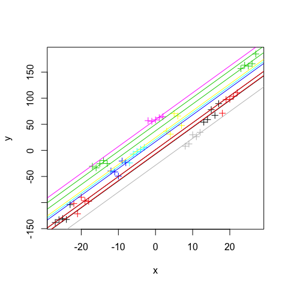

# Estimation of a random effect model with the BT package
Florian Hartig  
10 Jun 2016  


```r
set.seed(123)
library(BayesianTools)
```


# Creation of test case

I create a test dataset with a linear dependency between x and y, with an additional effect that is applied on a grouping factor - you can think of this as a region or site. The structure conforms to a random intercept model.


```r
a <- 5
b <- 10
sigma <- 10
rsigma = 30
group = rep(1:11, each = 5)
randomEffect = rnorm(11, sd = rsigma)

x <- -27:27
y <- a * x + b + rnorm(55,0,sd = sigma) + randomEffect[group]
plot(x,y, col = group, pch = 3)
```

<!-- -->

# Fitting the random effects model with BayesianTools 


```r
likelihood <- function(par){
  
  ax = par[1]
  bx = par[2]
  sigmax <- par[3]
  rsigmax = par[4]
  randomEffectx = par[5:15]
  
  llRandom = sum(dnorm(randomEffectx, sd = rsigmax, log = T))
  
  llObservation = sum(dnorm(ax * x + bx + randomEffectx[group] - y , sd = sigmax, log = T))
  return(llRandom + llObservation)
  
}
```


```r
library(BayesianTools)

setup <- createBayesianSetup(likelihood = likelihood, lower = c(-20,-20,0,0,rep(-100,11)), upper = c(20,20,50,100,rep(100,11)))
settings <- list(iterations = 10000, message=F)

res <- runMCMC(bayesianSetup = setup, settings = settings)
summary(res)
```

```
## # # # # # # # # # # # # # # # # # # # # # # # # # 
## ## MCMC chain summary ## 
## # # # # # # # # # # # # # # # # # # # # # # # # # 
##  
## # MCMC sampler:  DEzs 
## # Nr. Chains:  3 
## # Iterations per chain:  3334 
## # Rejection rate:  0.93 
## # Effective sample size:  37 
## # Runtime:  1.382  sec. 
##  
## # Parameter       MAP      2.5%    median   97.5% 
## #  par 1 :         5.720    3.770    5.435    6.192 
## #  par 2 :        16.742    9.025   17.811   19.936 
## #  par 3 :         8.666    8.033   12.800   33.307 
## #  par 4 :        23.666   19.600   31.927   79.297 
## #  par 5 :        -4.798  -48.880  -11.809   12.432 
## #  par 6 :        -3.597  -51.887  -16.889   14.156 
## #  par 7 :        44.355  -50.311   35.746   53.863 
## #  par 8 :         8.782  -37.221    2.976   21.580 
## #  par 9 :         6.684  -29.991    4.372   16.756 
## #  par 10 :       41.215   11.284   40.035   54.367 
## #  par 11 :        5.784  -21.309    4.226   15.690 
## #  par 12 :      -53.893  -58.237  -43.992   26.708 
## #  par 13 :      -30.606  -45.607  -30.791   35.565 
## #  par 14 :      -34.115  -45.167  -28.847   15.816 
## #  par 15 :        8.109  -22.678    9.255   31.056 
## 
## ## DIC:  570.353 
## ## Convergence 
##  Gelman Rubin multivariate psrf:   
##  
## ## Correlations 
##         par 1  par 2  par 3  par 4  par 5  par 6  par 7  par 8  par 9
## par 1   1.000 -0.235 -0.642 -0.497  0.701  0.614  0.637  0.495  0.395
## par 2  -0.235  1.000  0.111 -0.171 -0.271 -0.624  0.004 -0.437 -0.137
## par 3  -0.642  0.111  1.000  0.819 -0.759 -0.488 -0.925 -0.477 -0.751
## par 4  -0.497 -0.171  0.819  1.000 -0.585 -0.199 -0.751 -0.367 -0.575
## par 5   0.701 -0.271 -0.759 -0.585  1.000  0.537  0.744  0.505  0.501
## par 6   0.614 -0.624 -0.488 -0.199  0.537  1.000  0.366  0.693  0.373
## par 7   0.637  0.004 -0.925 -0.751  0.744  0.366  1.000  0.319  0.711
## par 8   0.495 -0.437 -0.477 -0.367  0.505  0.693  0.319  1.000  0.149
## par 9   0.395 -0.137 -0.751 -0.575  0.501  0.373  0.711  0.149  1.000
## par 10  0.534 -0.355 -0.439 -0.268  0.385  0.464  0.413  0.605  0.123
## par 11  0.470 -0.334 -0.628 -0.551  0.747  0.439  0.561  0.336  0.603
## par 12 -0.378 -0.214  0.706  0.633 -0.431  0.010 -0.789 -0.119 -0.585
## par 13 -0.427 -0.370  0.662  0.693 -0.534  0.083 -0.701 -0.144 -0.353
## par 14 -0.607  0.052  0.815  0.560 -0.591 -0.576 -0.825 -0.431 -0.654
## par 15 -0.133  0.511 -0.146 -0.299 -0.020 -0.485  0.244 -0.490  0.025
##        par 10 par 11 par 12 par 13 par 14 par 15
## par 1   0.534  0.470 -0.378 -0.427 -0.607 -0.133
## par 2  -0.355 -0.334 -0.214 -0.370  0.052  0.511
## par 3  -0.439 -0.628  0.706  0.662  0.815 -0.146
## par 4  -0.268 -0.551  0.633  0.693  0.560 -0.299
## par 5   0.385  0.747 -0.431 -0.534 -0.591 -0.020
## par 6   0.464  0.439  0.010  0.083 -0.576 -0.485
## par 7   0.413  0.561 -0.789 -0.701 -0.825  0.244
## par 8   0.605  0.336 -0.119 -0.144 -0.431 -0.490
## par 9   0.123  0.603 -0.585 -0.353 -0.654  0.025
## par 10  1.000  0.153 -0.406 -0.346 -0.335 -0.238
## par 11  0.153  1.000 -0.233 -0.273 -0.373 -0.154
## par 12 -0.406 -0.233  1.000  0.689  0.520 -0.375
## par 13 -0.346 -0.273  0.689  1.000  0.401 -0.590
## par 14 -0.335 -0.373  0.520  0.401  1.000  0.013
## par 15 -0.238 -0.154 -0.375 -0.590  0.013  1.000
```

```r
marginalPlot(res)
```

<!-- -->


# Fitting the model with alternative options

## Bayesian fit with JAGS


```r
  # 1) Model definition exactly how we created our data 
  modelCode = "
    model{
      
      # Likelihood
      for(i in 1:i.max){
        y[i] ~ dnorm(mu[i],tau)
        mu[i] <- a*x[i] + b + r[group[i]]
      }

      # random effect
      for(i in 1:nGroups){
        r[i] ~ dnorm(0,rTau)
      }

      # Prior distributions
      a ~ dnorm(0,0.001)
      b ~ dnorm(0,0.001)

      tau <- 1/(sigma*sigma)
      sigma ~ dunif(0,100)

      rTau <- 1/(rSigma*rSigma)
      rSigma ~ dunif(0,100)
    }
  "
  
  # 2) Set up a list that contains all the necessary data (here, including parameters of the prior distribution)
  Data = list(y = y, x = x, i.max = length(y), group = group, nGroups = 11)

  # 3) Specify a function to generate inital values for the parameters
  inits.fn <- function() list(a = rnorm(1), b = rnorm(1), sigma = runif(1,1,100), rSigma = runif(1,1,100))
```


For random effects and similar, I often prefer the R2jags package - not only that it has a bit simpler interface, but it also has different standard plots (those are taken from the STAN / Rstan package), which are a bit more complicated at first, but make it easier to display random effects. 


```r
library(R2jags)
```

```
## Loading required package: rjags
```

```
## Loading required package: coda
```

```
## Linked to JAGS 4.2.0
```

```
## Loaded modules: basemod,bugs
```

```
## 
## Attaching package: 'R2jags'
```

```
## The following object is masked from 'package:coda':
## 
##     traceplot
```

```r
system.time(R2JagsResults <- jags(data=Data, inits=inits.fn, parameters.to.save=c("a","b","sigma", "rSigma", "r"), n.chains=1, n.iter=10000, model.file=textConnection(modelCode)))
```

```
## module glm loaded
```

```
## Compiling model graph
##    Resolving undeclared variables
##    Allocating nodes
## Graph information:
##    Observed stochastic nodes: 55
##    Unobserved stochastic nodes: 15
##    Total graph size: 317
## 
## Initializing model
```

```
##    user  system elapsed 
##   0.461   0.007   0.482
```

```r
plot(R2JagsResults)
```

<!-- -->

```r
print(R2JagsResults)
```

```
## Inference for Bugs model at "5", fit using jags,
##  1 chains, each with 10000 iterations (first 5000 discarded), n.thin = 5
##  n.sims = 1000 iterations saved
##          mu.vect sd.vect    2.5%     25%     50%     75%   97.5%
## a          5.208   0.526   4.215   4.857   5.195   5.529   6.266
## b         14.184   9.248  -3.714   8.364  14.439  20.319  32.484
## r[1]     -11.170  15.845 -40.334 -21.688 -11.664  -1.512  20.756
## r[2]     -11.312  13.959 -36.557 -20.610 -11.986  -2.540  18.467
## r[3]      36.346  12.403  12.758  28.157  35.720  44.233  61.605
## r[4]       2.922  10.998 -17.695  -4.303   2.463   9.871  25.244
## r[5]       6.600  10.211 -13.989  -0.091   6.528  13.053  26.483
## r[6]      44.723   9.787  25.673  38.711  44.268  50.815  64.435
## r[7]      10.127  10.087 -10.007   3.775  10.153  16.696  29.463
## r[8]     -43.103  11.516 -66.689 -50.502 -42.760 -35.627 -22.775
## r[9]     -22.272  12.711 -49.024 -30.349 -21.409 -13.785   2.063
## r[10]    -21.804  14.391 -52.770 -30.900 -21.083 -12.015   5.313
## r[11]     21.454  16.662 -12.104  10.672  22.034  31.853  53.695
## rSigma    32.001   9.451  18.878  25.569  30.208  36.306  54.262
## sigma      8.706   1.012   7.063   7.975   8.584   9.298  11.031
## deviance 392.457   5.915 383.560 387.984 391.753 395.729 405.799
## 
## DIC info (using the rule, pD = var(deviance)/2)
## pD = 17.5 and DIC = 409.9
## DIC is an estimate of expected predictive error (lower deviance is better).
```


## Fitting the model with Maximum Likelihood, lme4

Adding the random intercept on group. Note that the variances are not correctly estimated. 


```r
library(lme4)
```

```
## Loading required package: Matrix
```

```r
fit <- lmer(y ~ x + (1|group))
summary(fit)
```

```
## Linear mixed model fit by REML ['lmerMod']
## Formula: y ~ x + (1 | group)
## 
## REML criterion at convergence: 426.4
## 
## Scaled residuals: 
##      Min       1Q   Median       3Q      Max 
## -1.79568 -0.58764  0.08457  0.54577  2.40455 
## 
## Random effects:
##  Groups   Name        Variance Std.Dev.
##  group    (Intercept) 761.70   27.599  
##  Residual              71.27    8.442  
## Number of obs: 55, groups:  group, 11
## 
## Fixed effects:
##             Estimate Std. Error t value
## (Intercept)  15.3235     8.3989   1.824
## x             5.1462     0.4434  11.607
## 
## Correlation of Fixed Effects:
##   (Intr)
## x 0.000
```

```r
plot(x,y, col = group,  pch = 3)
for(i in 1:11){
  abline(coef(fit)$group[i,1], coef(fit)$group[i,2], col = i)
}
```

<!-- -->
