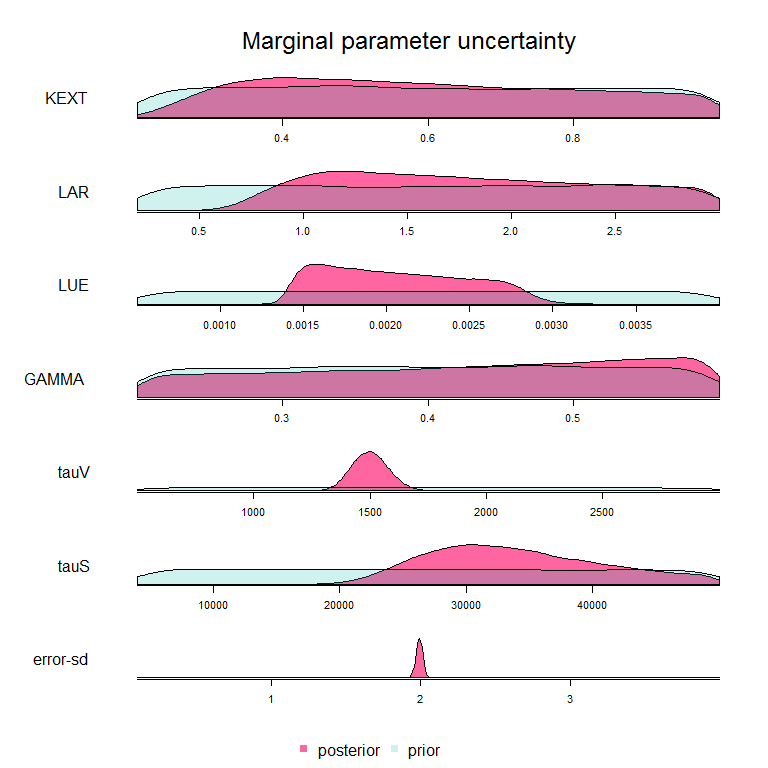
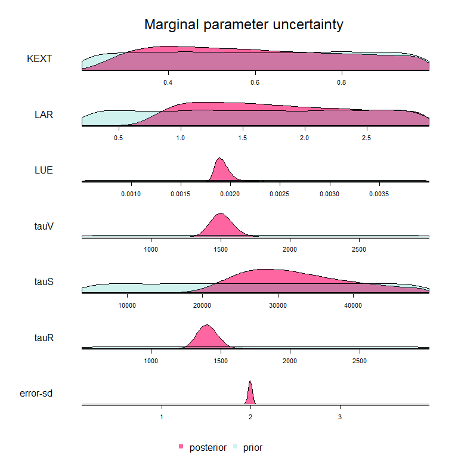
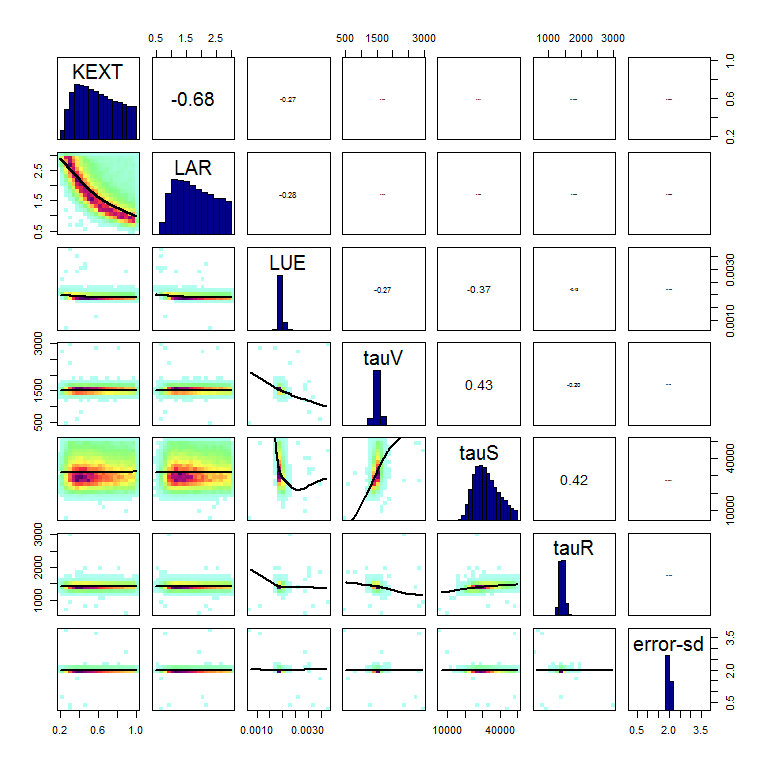

# Prior information 

## VSEM

The VSEM model is implemented in the BayesianTools package. A model description, including a detailed description of the meaning of the parameters can be found via ?BayesianTools::VSEM. 


The following reference parameters (for the creation of the synthetic data) and prior ranges were used for the example with strong posterior parameter correlation (equifinality). 


```
##               best lower upper
## KEXT         0.500 2e-01 1e+00
## LAR          1.500 2e-01 3e+00
## LUE          0.002 5e-04 4e-03
## GAMMA        0.400 2e-01 6e-01
## tauV      1440.000 5e+02 3e+03
## tauS     27370.000 4e+03 5e+04
## error-sd     2.000 1e-01 4e+00
```


The following reference parameters (for the creation of the synthetic data) and prior ranges were used for the example with weak posterior parameter correlation (no equifinality).


```
##               best lower upper
## KEXT         0.500 2e-01 1e+00
## LAR          1.500 2e-01 3e+00
## LUE          0.002 5e-04 4e-03
## tauV      1440.000 5e+02 3e+03
## tauS     27370.000 4e+03 5e+04
## tauR      1440.000 5e+02 3e+03
## error-sd     2.000 1e-01 4e+00
```


## 3PG

For reproducing our resutls, you should install the 3PG implementation in the threePGN package available via https://github.com/ForModLabUHel/threePGN-package

For new simulations, we recommend switching to the r3PG package, which is available from CRAN and described in Trotsiuk, Volodymyr, Florian Hartig, and David I. Forrester. "r3PG–An r package for simulating forest growth using the 3‐PG process‐based model." Methods in Ecology and Evolution 11.11 (2020): 1470-1475. This package and the paper also include some extended documentation of the model. 


```
##    reference priorMin priorMax
## 1     0.6000   0.5000   0.7000
## 2     1.4500   0.1000   2.8000
## 3     0.6500   0.4000   0.9000
## 4     0.0155   0.0010   0.0300
## 5     0.0600   0.0400   0.0800
## 6     8.5000   6.8000  10.2000
## 7     0.0040   0.0030   0.0050
## 8     0.0270   0.0216   0.0324
## 9     0.2500   0.0000   0.5000
## 10    0.4700   0.3760   0.5640
## 11    0.4350   0.3300   0.5400
## 12    0.0150   0.0120   0.0180
## 13   14.9000  12.8000  17.0000
## 14    0.0200   0.0160   0.0240
## 15    1.3250   1.1500   1.5000
## 16    0.1500   0.1200   0.1800
## 17    0.2500   0.2000   0.3000
## 18    0.5000   0.4000   0.6000
## 19    0.1750   0.0500   0.3000
## 20    3.3300   2.6640   3.9960
## 21    3.5000   2.0000   5.0000
## 22    0.8000   0.6400   0.9600
## 23    0.0500   0.0400   0.0600
## 24    1.0000   0.8000   1.2000
## 25    0.1250   0.1000   0.1500
## 26    1.5000   0.0000   3.0000
## 27    4.0500   3.7000   4.4000
## 28    1.9000   0.8000   3.0000
## 29    0.1000   0.0000   0.2000
## 30    1.6000   1.2000   2.0000
## 31   36.0000  32.0000  40.0000
## 32    0.1500   0.1200   0.1800
## 33    2.0500   0.6000   3.5000
## 34   12.2500  10.5000  14.0000
## 35    0.2000   0.1600   0.2400
## 36    3.5000   2.0000   5.0000
## 37   12.0000   9.6000  14.4000
## 38  140.0000  80.0000 200.0000
## 39    0.8800   0.7600   1.0000
## 40    0.0010   0.0008   0.0012
## 41    0.0005   0.0004   0.0006
## 42    0.5000   0.4500   0.5500
## 43   10.0000   8.0000  12.0000
## 44    1.5000   0.0000   3.0000
## 45   40.0000  30.0000  50.0000
## 46    0.0250   0.0000   0.0500
## 47    0.5000   0.2000   0.8000
## 48    0.5000   0.2000   0.8000
## 49    0.7000   0.4000   1.0000
## 50    0.5000   0.2000   0.8000
## 51    0.8000   0.6000   1.0000
## 52    1.0000   0.2000   2.0000
## 53    1.0000   0.2000   2.0000
```

The following reference parameters (for the creation of the synthetic data) and prior ranges were used for the 3PG model. 


```r
?threePGN::data_param
```

The meaning and units of the parameters are described in ?threePGN::data_param


# Reference posterior estimates

Here, we show the reference posterior estimates, created with an extremely long DEzs sampler. It is assumed that these are very close to the "true" (= mathematically exact) posterior distributions, and can thus be used as a reference. Since the model used in the 3PGN_sleep experiments is identical to the one in 3PGN, figures for the 3PGN_sleep are omitted. 

The SMC posterior estimates for the different settings are avaialble [here](https://www.dropbox.com/s/dndmyv8atg8vhsy/SMCruns.html?dl=0). To reproduce the underlying scripts, the MCMC / SMC samplers need to be placed in a subfolder data of this folder. 

## VSEM - Case with strong correlation

Here the marginal posterior uncertainty



Here the posterior parameter correlation 


```r
correlationPlot(save.list[[3]])
```


## VSEM - Case without strong correlation

Here the marginal posterior uncertainty



Here the posterior parameter correlation 




## 3PG

Here the marginal posterior uncertainty


Here the posterior parameter correlation, for reasons of space only for the parameters with the visually largest marginal posterior uncertainty


